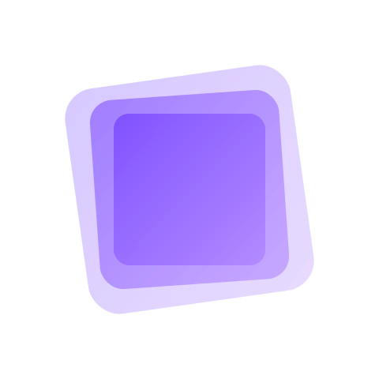

# 🚀 Onionl-UI

一个基于 Vue 3 的现代化轻量级组件库。

<div align="center">
  

[](https://npmjs.org/package/onionl-ui)
[](https://npmjs.org/package/onionl-ui)

中文 | [English](./README.md)
</div>

⚠️ 该项目仍处于早期开发阶段。

🌱 这是我的第一个开源项目。作为初学者，我希望通过这个项目学习和成长，欢迎任何的反馈和贡献！

## ✨ 特性

- 🎯 基于 Vue 3 + TypeScript，提供完整的类型定义
- 🎨 支持主题定制，可配置的设计令牌
- 📦 支持按需引入，减小打包体积
- 🔧 提供丰富的组件和 Hooks
- 📚 详尽的文档和示例

## 🚀 安装

使用 npm:

```bash
npm install onionl-ui
```

使用 yarn:

```bash
yarn add onionl-ui
```

使用 pnpm:

```bash
pnpm add onionl-ui
```

## 🔨 快速上手

```ts
import OnionlUI from 'onionl-ui'
import { createApp } from 'vue'
import App from './App.vue'
import 'onionl-ui/dist/style.css'

const app = createApp(App)
app.use(OnionlUI)
app.mount('#app')
```

## 📦 组件

基础用法:

```html
<template>
  <ol-button type="primary">
    主要按钮
  </ol-button>
  <ol-button type="secondary">
    次要按钮
  </ol-button>
  <ol-button size="lg">
    大按钮
  </ol-button>
</template>
```

更多组件用法请查看[组件文档](https://onionl-ui.dev/components/)。

## 📄 许可证

[MIT](./LICENSE) License © 2024 XL
